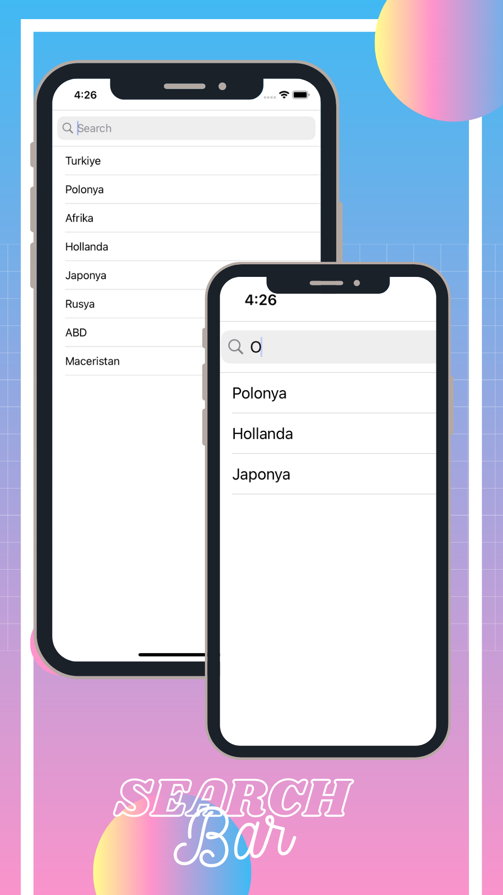

# SearchBar_UseOf

The use of tableview and search bar together. Two arrays were used in this study. One of them holds all the data and the other is an array where the data is kept according to the search.

